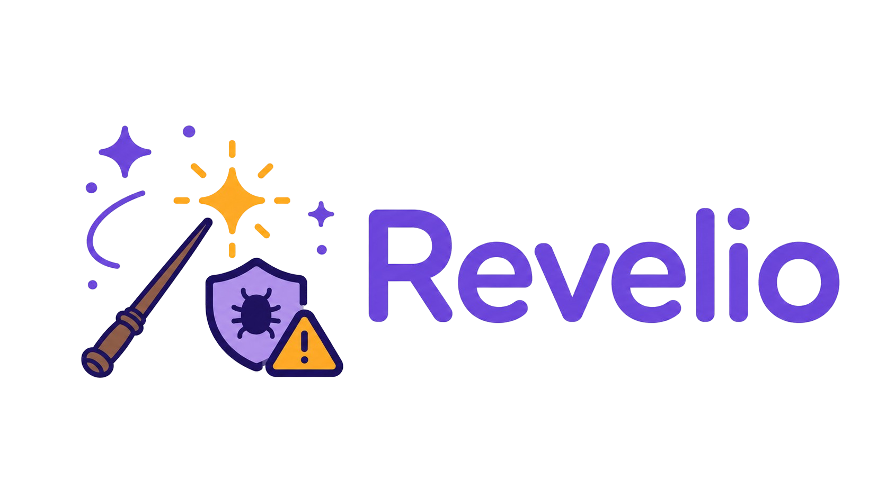

<div align="center">



**Cost-efficient agentic memory-safety vulnerability detection for repository-scale codebases.**

📄 [Paper (arXiv)](https://arxiv.org/abs/2606.22263) · UC Berkeley

</div>

Revelio is an end-to-end AI agent that discovers memory-safety vulnerabilities in large C/C++ codebases, and only reports a finding once it has reproduced it with a sanitizer. Because every discovery is backed by an executable Proof-of-Vulnerability (PoV), Revelio avoids the hallucinated, unverifiable reports that plague naive LLM-based bug hunting.

- **Discovers** candidate vulnerabilities through broad, high-recall code review with cheap models.
- **Confirms** each candidate by building a PoV input and running the program under AddressSanitizer / UBSan / MSan.
- **Reports** only sanitizer-confirmed bugs, with a full write-up and reproduction steps.

> In the evaluation, Revelio uncovered **19 previously unknown memory-safety vulnerabilities** (7 CVEs assigned/requested) across seven mature OSS-Fuzz projects that had already been continuously fuzzed for 5–8 years, at roughly **$42 and ~1 hour per project** with **zero false positives**. On the CyberGym/ARVO benchmark it substantially outperformed frontier coding agents (Claude Code, Codex, etc.) at comparable cost.

## Architecture

Revelio's key insight is to **separate speculative reasoning from executable confirmation**. Detection is decomposed into two stages: a cheap, high-*recall* Generation Stage and a high-*precision* Confirmation Stage. Cheap models cast a wide net (a false hypothesis can be filtered later); stronger models plus a deterministic sanitizer serve as the trustworthy verifier.

```
 repository ──► Stage 1: Hypothesis Generation ──► Stage 2: Hypothesis Confirmation ──► bug reports
 source code       (cheap, high recall)                (stronger, high precision)          + PoV files
                ScanFilterOrchestrator                MultiAgentOrchestrator
```

### Stage 1 — Hypothesis Generation

Scans every source file to build a broad pool of candidate hypotheses, then funnels it down through triage, dedup, filtering, and ranking. Organized as two bands:

*Proposal band — high-recall expansion (per file):*

1. **Static preprocessing** — parse with tree-sitter, extract function boundaries, and run a lightweight intraprocedural check analyzer that flags which parameters lack NULL/bounds/validation guards.
2. **Summarize file content** — one LLM pass builds a functional summary used as context (no hypotheses yet).
3. **Synthesize hypotheses** — multiple LLM passes from different angles (whole-file, focused passes, per-function batches) emit candidate hypotheses as structured JSON → **Raw Hypothesis Pool**.

*Refinement band — precision and ranking:*

4. **Sanitizer-aware triage** — one LLM call per hypothesis hints whether it is a real, sanitizer-triggerable memory-safety bug (asan/ubsan/msan) and tags suggested severity/primitive/CWE → **In-scope Hypotheses**.
5. **Deduplicate root causes** — line/CWE-overlap prefilter + pairwise LLM judgement + union-find merge → **Merged Hypotheses**.
6. **Reachability annotation** — `arvo targets <symbol>` (deterministic `nm` lookup) records which test-harness (entry-point) binaries link each hotspot function. Advisory ranking signal, not a hard filter.
7. **Independent static filtering** — a real Docker **sub-agent** (`DefaultAgent` + unrestricted `bash`) traces callers/callees repo-wide and votes VALID/INVALID on each hypothesis.
8. **Rank for PoV confirmation** — deterministic sort by `(reachable, severity, confidence)` → **Ranked Hypothesis Queue**.

The queue is saved to `hypotheses.json` (reusable via `--hypotheses-file`).

### Stage 2 — Hypothesis Confirmation by PoV Construction

For each of the top `--top-n` hypotheses:

1. **Iterative PoV construction** (`PoVBuilderAgent`) — a stronger model receives a *context packet* (hypothesis, code references, selected harness, etc.) and iterates with three tools: `bash` (inspect code / write files), `validate` (test a candidate PoV), and `finish` (submit results). It writes a Python script that emits raw PoV input bytes and refines it based on validation feedback, up to `--max-pov-attempts` times.
2. **Sanitizer-backed confirmation** — the `validate` tool runs the harness against **all available sanitizers** (asan, ubsan, msan) and parses crash signatures. A hypothesis is confirmed only when a sanitizer reproducibly crashes; the orchestrator independently re-executes the input to guard against fabricated success.
3. **Reporting** (`ReporterAgent`) — writes the final developer-facing bug report with vulnerability details, triggering input, sanitizer output, and reproduction steps.

Deliverables (report, PoV input, PoV generator script) are copied out of the container only on a confirmed crash.

### Model tiers

Revelio assigns different model tiers to different tasks:

| Flag | Stage | Role | Paper default |
|------|-------|------|---------------|
| `--hypothesis-model` | Stage 1 | Cheap/fast model for summarize + synthesize + triage + dedup + filtering | Haiku 4.5 |
| `--pov-model` | Stage 2 | Strongest model for PoV building + validation + report (defaults to `--hypothesis-model`) | Sonnet 4.6 |

## Quick Start

### Requirements

- Python ≥ 3.10 (3.12 recommended)
- Docker (or Podman) — every codebase-under-test runs inside a container for isolation and reproducibility

### Installation

```bash
git clone https://github.com/m1-llie/Revelio.git
cd Revelio

conda create -n revelio python=3.12 -y
conda activate revelio
pip install -e .
```

Installing the package also exposes a `revelio` console command (equivalent to `python -m revelio.run.detect`), used throughout this README.

### Configuration

Create a `.env` file in the project root (or export the equivalent environment variables):

```bash
# Required: a default model + its API key
MODEL_NAME=anthropic/claude-haiku-4-5
ANTHROPIC_API_KEY=sk-ant-...

# Or use Gemini
# MODEL_NAME=gemini/gemini-2.5-pro
# GEMINI_API_KEY=AIza...
```

`MODEL_NAME` is the default for `--model`; the provider prefix (`anthropic/`, `gemini/`, …) is required. See [Environment Variables](#environment-variables) for the full list.

## Building OSS-Fuzz Docker Images

`scripts/prepare_ossfuzz_project.sh` builds any [OSS-Fuzz](https://github.com/google/oss-fuzz) project into a revelio-ready Docker image with the same interface as [ARVO](https://github.com/n132/ARVO) images.

```bash
scripts/prepare_ossfuzz_project.sh openssl                           # single project
scripts/prepare_ossfuzz_project.sh openssl assimp curl               # multiple projects
scripts/prepare_ossfuzz_project.sh --sanitizers asan,ubsan openssl   # if skip MSan
scripts/prepare_ossfuzz_project.sh --oss-fuzz-dir /data/oss-fuzz openssl
```

The script clones/updates oss-fuzz, builds fuzzers with each sanitizer via `infra/helper.py build_fuzzers`, packages them into a single Docker image, and cleans it for zero-day detection. Sanitizers that fail to build are skipped automatically.

The resulting `revelio/<project>:latest` image contains:

```
/src/<project>/              source code (from the gcr.io/oss-fuzz/<project> base image)
/out/asan/<fuzzer_binaries>  AddressSanitizer builds
/out/ubsan/<fuzzer_binaries> UndefinedBehaviorSanitizer builds
/out/msan/<fuzzer_binaries>  MemorySanitizer builds
/usr/bin/arvo                fuzzer runner script (scripts/arvo_ossfuzz)
```

Re-run the script to pick up upstream source code changes.

### The `arvo` script

`scripts/arvo_ossfuzz` is installed at `/usr/bin/arvo` inside the container. It provides the same interface as ARVO images, extended for multi-sanitizer and multi-target support:

```bash
arvo                         # run default fuzzer with /tmp/poc (SANITIZER=asan)
arvo list                    # list fuzz targets for current SANITIZER
arvo list --all              # list fuzz targets across all sanitizers
arvo run <fuzzer> [poc]      # run a specific fuzzer (default input: /tmp/poc)
arvo targets <symbol>        # find which fuzz targets link a given function (nm lookup)
arvo compile                 # recompile the project
SANITIZER=ubsan arvo         # switch sanitizer
```

`SANITIZER` env var (default: `asan`) selects which `/out/<sanitizer>/` build to use. `DEFAULT_FUZZER` env var overrides auto-detection when multiple targets exist. Standard ASAN/MSAN/UBSAN env vars are exported automatically.

The orchestrator uses `arvo targets <function>` to match hypotheses to reachable fuzz targets before launching the PoV builder. The validate tool uses `SANITIZER=` to test PoVs against all available sanitizers.

### Verifying the image

```bash
docker run --rm revelio/openssl:latest arvo list --all
docker run --rm -v /path/to/pov:/tmp/poc:ro revelio/openssl:latest arvo run openssl_fuzzer
docker run --rm -v /path/to/pov:/tmp/poc:ro -e SANITIZER=ubsan revelio/openssl:latest arvo run openssl_fuzzer
```

## Revelio for Vulnerability Detection

### ARVO Targets

[ARVO](https://github.com/n132/ARVO) provides pre-built Docker images with fuzzing infrastructure.

```bash
revelio \
    --arvo n132/arvo:42470801-vul \
    --hypothesis-model anthropic/claude-haiku-4-5

# Scan a specific file only
revelio \
    --arvo n132/arvo:42470801-vul \
    --hypothesis-model anthropic/claude-haiku-4-5 \
    --target-file ffmpeg/tools/target_dec_fuzzer.c
```

> **Note:** `arvo:xxx-vul-clean` images are produced using `python -m revelio.run.clean_arvo`
> to remove pre-existing PoVs, crashers, and seed corpus from ARVO-vul images.

### OSS-Fuzz Targets

For OSS-Fuzz Docker images built with the steps above:

```bash
revelio \
    --arvo revelio/assimp:latest \
    --hypothesis-model anthropic/claude-haiku-4-5
```

### Custom Projects

```bash
revelio \
    --project ./my-project \
    --hypothesis-model anthropic/claude-haiku-4-5 \
    --target-file src/parser.c
```

Use `--docker-image` to specify a custom Docker base image (default: `revelio/memcheck:latest`).

### Resuming from saved hypotheses

Stage 1 saves its ranked queue to `output/<run_id>/hypotheses.json`. You can skip the hypothesis generation stage and go straight to Stage 2 PoV construction:

```bash
revelio \
    --arvo revelio/assimp:latest \
    --hypotheses-file output/<run_id>/hypotheses.json \
    --pov-model anthropic/claude-sonnet-4-6
```

### Key Flags

| Flag | Default | Description |
|------|---------|-------------|
| `--arvo`, `-a` | — | ARVO / OSS-Fuzz Docker image to analyze (mutually exclusive with `--project`) |
| `--project`, `-p` | — | Path to a local project to analyze (copied into a container) |
| `--hypothesis-model` | `MODEL_NAME` | Model for Stage 1 hypothesis generation and filtering (see [Model tiers](#model-tiers)) |
| `--target-file`, `-t` | — | Restrict scan to a single file |
| `--max-workers` | `4` | Parallel workers for hypothesis generation |
| `--top-n` | `5` | Number of top hypotheses to pursue |
| `--max-pov-attempts` | `5` | Max validation attempts per hypothesis (PoVBuilder's `validate` tool calls) |
| `--keep-container` | `false` | Keep Docker container after run (for debugging) |
| `--verbose`, `-v` | `false` | Show DEBUG-level logs (raw Docker commands, per-file cleanup steps, etc.) |
| `--agents-config-dir` | built-in | Custom directory for per-agent YAML configs |
| `--pov-model` | same as `--hypothesis-model` | Model for PoV builder/reporter agents |
| `--max-functions` | `50` | Max functions to analyze per file in scan_filter |
| `--agent-step-limit` | `20` | Max steps per scan_filter sub-agent |
| `--agent-cost-limit` | `2.0` | Max cost (USD) per scan_filter sub-agent |
| `--base-url` | — | LiteLLM proxy base URL |
| `--api-key` | `MODEL_API_KEY` | API key for LLM calls |
| `--hypotheses-file` | — | Load pre-generated hypotheses, skip scan stage |

## Environment Variables

### Model Selection

| Variable | Description |
|----------|-------------|
| `MODEL_NAME` | Default model name, e.g. `anthropic/claude-haiku-4-5`, `gemini/gemini-2.5-pro`. Always include the provider prefix. Can be overridden with `--hypothesis-model`. |

### API Keys

| Variable | Description |
|----------|-------------|
| `MODEL_API_KEY` | Generic API key passed to litellm. Works for any provider. |
| `MODEL_API_KEYS` | Comma-separated pool of API keys for parallel workers (round-robin assignment). Useful when running multiple workers to avoid rate limits. |
| `ANTHROPIC_API_KEY` | Anthropic API key (used automatically by litellm for `anthropic/*` models) |
| `GEMINI_API_KEY` | Google Gemini API key (used automatically by litellm for `gemini/*` models) |

> **Tip:** You only need the provider-specific key for your chosen model. `MODEL_API_KEY` is an alternative that works across providers via litellm.


### Cost and Rate Limits

| Variable | Default | Description |
|----------|---------|-------------|
| `GLOBAL_COST_LIMIT` | `0` (disabled) | Maximum total cost in USD across all model calls. The run aborts if exceeded. |
| `GLOBAL_CALL_LIMIT` | `0` (disabled) | Maximum total API calls across all agents. The run aborts if exceeded. |
| `MODEL_RETRY_STOP_AFTER_ATTEMPT` | `10` | Number of retries on transient API errors (uses exponential backoff). |

### Runtime

| Variable | Default | Description |
|----------|---------|-------------|
| `DOCKER_EXECUTABLE` | `docker` | Path to Docker/Podman executable |
| `CONFIG_DIR` | `.` | Override location for YAML config files |
| `SILENT_STARTUP` | unset | If set, suppress the startup banner and cost/call limit messages |

## Outputs

Each run writes to `output/<run_id>/`:

```
output/<run_id>/
├── manifest.json          # Run metadata (target, model, pipeline mode, parameters)
├── events.jsonl           # Append-only event log (JSON Lines)
├── log.txt                # Human-readable timestamped log
├── hypotheses.json        # Saved hypotheses (reusable with --hypotheses-file)
├── trajectory.json        # Aggregated multi-agent trajectories
└── artifacts/
    ├── handoffs/          # Inter-agent data (one JSON per stage + hypothesis)
    │   ├── hypotheses.json
    │   ├── pov_recipe_H01.json
    │   ├── validation_H01.json
    │   └── report_H01.json
    └── deliverables/      # Final outputs (copied from container on success)
        ├── final_report_H01.md
        ├── pov_H01
        └── result_script_H01.py
```

- **`manifest.json`** — records run_id, target, model, pipeline mode, top_n, max_workers
- **`events.jsonl`** — real-time event stream: `run_start`, `agent_start`, `agent_end`, `pov_attempt`, `validation_failed`, `run_success`, etc.
- **`trajectory.json`** — full conversation history for all agents, keyed by agent name
- **`handoffs/`** — structured JSON data passed between pipeline stages
- **`deliverables/`** — the final artifacts: bug report, PoV input file, and PoV generator script (only present when a vulnerability is confirmed)

### Cost Reports

```bash
# Summarize direct API cost plus cache/uncached token-cost estimates
SILENT_STARTUP=1 python tools/cost_report.py output/<run_id>

# Also write output/<run_id>/cost_report.json and cost_report.md
SILENT_STARTUP=1 python tools/cost_report.py output/<run_id> --write
```

The report reads saved `trajectory.json` and `traces/*.json`. For agent trajectories it can split cost into cached input, uncached input, and output when Anthropic/LiteLLM usage fields are present. Some scan_filter proposal/refinement traces currently only save aggregate `cost`/`calls`, so those stages are included in direct API cost but cannot always be split into cached/uncached tokens retroactively.

### Validating PoVs

Validate PoVs against ARVO `-fix` images:

```bash
python tools/validate_pov.py \
    --run-dir output/<run_id> \
    --pov output/<run_id>/artifacts/deliverables/pov_H01
```

## Project Structure

```
Revelio/
├── src/revelio/
│   ├── agents/          # Agent implementations (DefaultAgent)
│   ├── analysis/        # Static C/C++ check analyzer (tree-sitter)
│   ├── artifacts/       # Artifact store (typed, append-only, thread-safe)
│   ├── config/          # YAML configs: agents/, arvo_targets.json
│   ├── environments/    # Execution environments (Docker)
│   ├── models/          # LLM interfaces (LiteLLM, Anthropic)
│   ├── orchestrator/    # ScanFilterOrchestrator (Stage 1) + MultiAgentOrchestrator (Stage 2)
│   ├── run/             # CLI entry point (detect.py) + clean_arvo
│   ├── tools/           # Agent tools (bash/validate/finish)
│   └── utils/           # Utility functions
├── tools/               # Standalone CLIs: cost_report, inspector, validate_pov
├── scripts/             # OSS-Fuzz image builder, arvo runner, batch helpers
├── docker/              # Base image Dockerfiles
└── website/             # Web trace viewer
```


## Check Agent Running Trajectories

### Textual TUI for browsing trajectory JSON files

```bash
# TUI trajectory inspector (vim-style keybindings)
python tools/inspector.py output/<run_id>/trajectory.json

# Or browse an entire output directory
python tools/inspector.py output/
```

## Web Trace Viewer

Browse agent run outputs in a web interface:

```bash
python3 website/server.py [--host HOST] [--port PORT] [--output-dir DIR ...]
```

| Option | Default | Description |
|--------|---------|-------------|
| `--host` | `127.0.0.1` | Host to bind (localhost only for security) |
| `--port` | `8877` | Port number |
| `--output-dir` | `output/` | Custom output directories to scan |

**Remote access via SSH tunnel:**

```bash
# On local machine
ssh -L 8877:127.0.0.1:8877 <username>@<server>

# Then open http://localhost:8877
```
